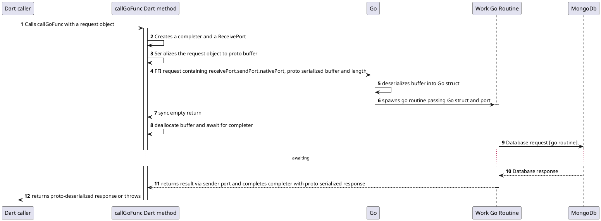

```plantuml
@startuml
autonumber

participant "Dart caller" as caller
participant "callGoFunc Dart method" as dart
participant Go as go
participant "Work Go Routine" as gor
participant MongoDb as mongo

caller -> dart: Calls callGoFunc with a request object
activate dart
dart -> dart: Creates a completer and a ReceivePort
dart -> dart: Serializes the request object to proto buffer
dart -> go: FFI request containing receivePort.sendPort.nativePort, proto serialized buffer and length  
activate go
go -> go: deserializes buffer into Go struct
go -> gor : spawns go routine passing Go struct and port
activate gor
dart <-- go: sync empty return
deactivate go
dart -> dart: deallocate buffer and await for completer
gor -> mongo: Database request [go routine]
... awaiting ...
gor <-- mongo: Database response
dart <-- gor : returns result via sender port and completes completer with proto serialized response
deactivate gor
caller <-- dart : returns proto-deserialized response or throws
deactivate dart


@enduml
```