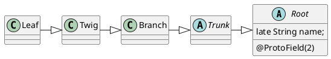

```plantuml

@startuml

abstract Root {
  @ProtoField(2)
  late String name;
}

abstract Trunk {

}

Trunk -|> Root

class Branch {

}

Branch -|> Trunk

class Twig {

} 

Twig -|> Branch

class Leaf {

}

Leaf -|> Twig

@enduml
```